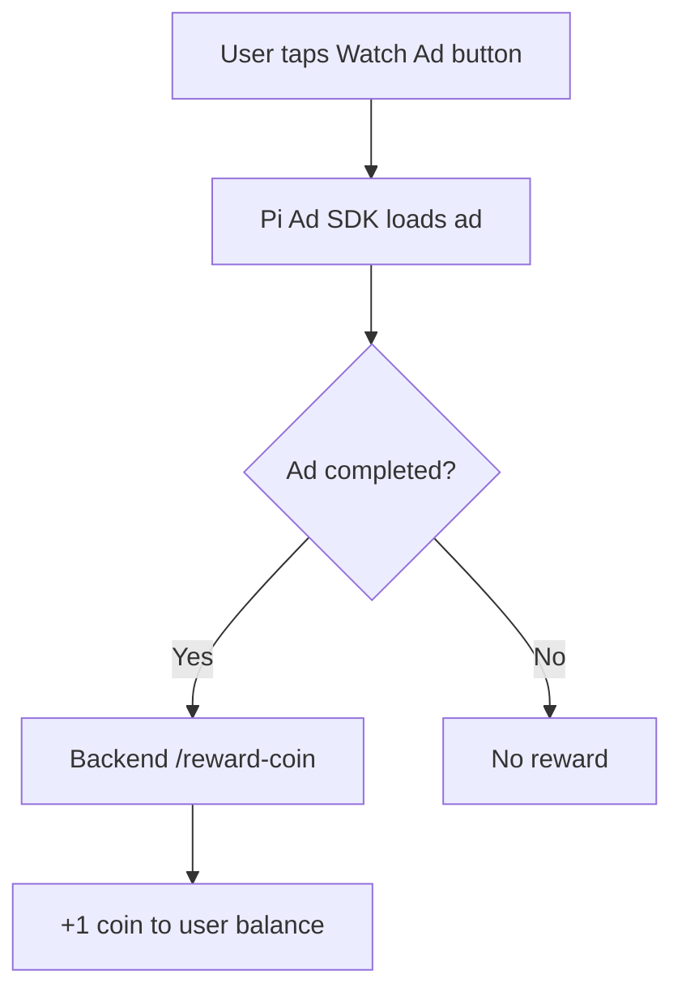

# 📄 `ads_reward_system.md`

## 🎯 Purpose

The Ads Reward System enables users to **earn Droplet Coins** by watching **rewarded video ads**. This encourages user engagement, offers a free alternative to buying coins with Pi, and helps monetize the app using Pi Ad Network.

---

## 🧩 Key Features

| Feature               | Description                                             |
| --------------------- | ------------------------------------------------------- |
| 🪙 Reward             | +1 Droplet Coin per successful ad view                  |
| ⏱ Cooldown (optional) | Prevents abuse by limiting how often ads can be watched |
| 📲 Pi Ad Integration  | Uses Pi Ad SDK for video ads                            |
| 📤 Backend Logging    | Logs ad reward and timestamps in Supabase               |
| 🔒 Fraud Prevention   | Validates ad reward only after "completed" status       |

---

## 🛠️ Technical Architecture



---

## 📱 Frontend Implementation

### `RewardAdButton.tsx`

```tsx
import { useState } from 'react';

export default function RewardAdButton() {
  const [loading, setLoading] = useState(false);

  const watchAd = async () => {
    setLoading(true);

    try {
      // Simulated Pi Ad SDK behavior
      const adWatched = await simulateAdView(); // replace with real Pi Ad call
      if (adWatched) {
        await fetch('/api/reward-coin', { method: 'POST' });
        alert('🎉 You earned 1 coin!');
      } else {
        alert('Ad not completed.');
      }
    } catch (err) {
      alert('Ad failed to load.');
    } finally {
      setLoading(false);
    }
  };

  return (
    <button
      onClick={watchAd}
      disabled={loading}
      className="bg-green-500 hover:bg-green-600 text-white px-6 py-3 rounded-lg"
    >
      🎥 {loading ? 'Loading...' : 'Watch Ad to Earn 1 Coin'}
    </button>
  );
}

function simulateAdView() {
  return new Promise((resolve) => setTimeout(() => resolve(true), 3000));
}
```

---

## 🔒 Backend Route: `/api/reward-coin`

### Method: `POST`

### Request:

```json
{
  "userId": "uuid-from-session"
}
```

### Response:

```json
{
  "success": true,
  "new_balance": 11
}
```

### Logic:

* Validate user session.
* Prevent multiple rewards in short time (optional).
* Log reward in `ads_rewards` table.
* Update `coins` column in `users` table.

---

## 🧮 Supabase Tables

### `users`

| Column | Type | Description          |
| ------ | ---- | -------------------- |
| id     | UUID | Primary key          |
| coins  | INT  | Droplet coin balance |

---

### `ads_rewards`

| Column    | Type      | Description             |
| --------- | --------- | ----------------------- |
| id        | UUID      | Primary key             |
| user\_id  | UUID      | FK to `users.id`        |
| timestamp | TIMESTAMP | When the ad was watched |
| reward    | INT       | Usually 1 coin          |

---

## ⚠️ Optional Cooldown Logic

To prevent spam, add a cooldown:

```sql
SELECT * FROM ads_rewards
WHERE user_id = 'user-id'
AND timestamp > NOW() - INTERVAL '30 minutes'
```

If results exist, block the new reward.

---

## 🧪 Testing

| Test Case               | Expected Result              |
| ----------------------- | ---------------------------- |
| Watch ad → Complete     | +1 coin added                |
| Close ad early          | No coin reward               |
| Watch multiple ads fast | Blocked after cooldown limit |

---

## 🔌 Integration Checklist

* [x] Button triggers ad SDK
* [x] Backend logs + updates coin balance
* [x] Frontend notifies user
* [x] Optional cooldown applied
* [x] Supabase tables updated

---

## ✅ Future Improvements

* Daily ad view limit (e.g., 5/day)
* Bonus ads (e.g., 2 coins on weekends)
* Ad streak rewards

---
