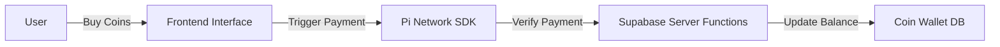

# 📄 pi\_payment\_integration.md

## Overview

This document describes the integration of **Pi Network Payments** into the Droplet Pet App. The system allows users to purchase **Droplet Coins** using **Pi** cryptocurrency, which can be used to unlock premium content (characters, room themes, items, etc.).

---

## 🔗 Integration Architecture



---

## 🔧 Requirements

* ✅ Pi Network SDK (Frontend)
* ✅ Backend service (e.g., Supabase Edge Functions or Node.js server)
* ✅ Supabase Database with user coin balances
* ✅ Verified Pi Developer account
* ✅ Sandbox testing wallet

---

## ⚙️ Payment Flow (User Perspective)

1. User selects a coin package from the **Coin Store**.
2. App opens Pi Network **payment dialog** using `Pi.createPayment`.
3. Payment is completed through the Pi Wallet.
4. Backend **verifies** the payment.
5. On successful verification:

   * User receives coins.
   * Transaction is logged.

---

## 🛒 Coin Packages

| Coins | Pi Cost | Bonus           |
| ----- | ------- | --------------- |
| 10    | 1 Pi    | —               |
| 100   | 10 Pi   | —               |
| 150   | 12 Pi   | 🎁 Bonus Pack   |
| 300   | 20 Pi   | 🔥 Special Deal |
| 1000  | 50 Pi   | 💎 Premium Tier |

---

## 🧠 Frontend Example (React + Pi SDK)

```ts
// initiatePiPayment.ts
import { showPiPayment } from './pi-sdk';

export async function initiatePiPayment(amount: number, userId: string) {
  const paymentData = {
    amount, // in Pi
    memo: `Buy ${amount * 10} Droplet Coins`,
    metadata: { userId },
  };

  try {
    const payment = await window.Pi.createPayment(paymentData, async function onReadyForServerApproval(paymentId) {
      const response = await fetch('/api/verify-payment', {
        method: 'POST',
        body: JSON.stringify({ paymentId, userId }),
      });
      return await response.json();
    });

    return payment;
  } catch (err) {
    console.error('Pi Payment Error:', err);
    return null;
  }
}
```

---

## 🔐 Backend Example (Supabase Edge Function)

```ts
// /functions/verify-payment.ts
import { createClient } from '@supabase/supabase-js';
const supabase = createClient(SUPABASE_URL, SUPABASE_KEY);

export async function verifyPayment(request: Request) {
  const { paymentId, userId } = await request.json();

  const isValid = await verifyWithPiNode(paymentId); // Implement via Pi Network node
  if (!isValid) return new Response('Invalid Payment', { status: 403 });

  // Determine coin reward based on payment metadata
  const coins = calculateCoinsByPaymentId(paymentId);

  // Update coin balance
  await supabase
    .from('user_wallet')
    .update({ coins: supabase.raw(`coins + ${coins}`) })
    .eq('user_id', userId);

  return new Response(JSON.stringify({ success: true, coins }));
}
```

---

## 🗃️ Supabase Database Table: `user_wallet`

```sql
CREATE TABLE user_wallet (
  user_id UUID PRIMARY KEY,
  coins INTEGER DEFAULT 0,
  updated_at TIMESTAMP DEFAULT NOW()
);
```

---

## 🧪 Test Flow with Pi Sandbox

1. Use **Pi Test Wallet** with sandbox credentials.
2. Set Pi SDK to sandbox mode:

   ```js
   window.Pi.init({ version: '2.0', sandbox: true });
   ```
3. Simulate payment with fake Pi and confirm coin delivery.

---

## ✅ Verifying Real Payments

1. Use Pi Node or Server endpoint for validating payment.
2. Ensure payment ID matches, is recent, and contains correct metadata.
3. Use signed requests or webhooks from Pi Network if available.

---

## 🔄 Refund or Failure Logic

* On failed payment, user receives an error and no coins.
* On partial failure (e.g., network drop), retry logic can be enabled.
* Add `transaction_log` for audit tracking.

---

## 🛡️ Security Best Practices

* Do not credit coins until server-side verification completes.
* Never trust client-only confirmation.
* Encrypt sensitive requests and store payment receipts securely.

---

## 🔚 Summary

* Users buy coins using **Pi**.
* Coins are used for shopping in-app items, characters, and upgrades.
* Pi SDK + backend verification ensures secure payment flow.

---

