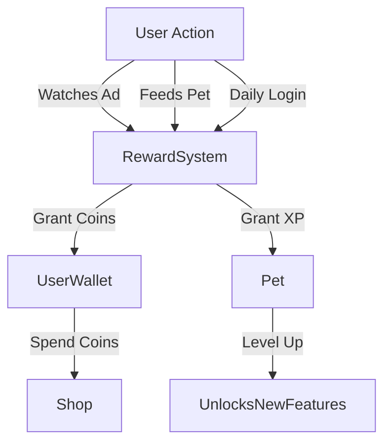

# Reward System Documentation

## Overview

The reward system in Droplet Pet App incentivizes user engagement by providing coins and experience points (XP) for interacting with the app and caring for their Droplet pet. Rewards fuel the in-app economy, allowing users to purchase items, upgrade characters, and unlock features.

---

## Reward Types

| Reward Type                | Description                                      | Currency/Value          |
| -------------------------- | ------------------------------------------------ | ----------------------- |
| **Coins**                  | In-app currency earned by user actions           | Integer coin amount     |
| **Experience Points (XP)** | Points accumulated to level up the pet character | Integer XP amount       |
| **Daily Bonus**            | Bonus coins awarded once per day                 | Fixed or variable coins |
| **Ad Reward**              | Coins earned by watching Pi Network rewarded ads | Fixed coins per ad      |

---

## Earning Coins

### 1. Watching Ads

* Each completed Pi rewarded ad grants the user **1 Coin**.
* The user can watch multiple ads, but ads are throttled for fairness (e.g., max 10 ads/day).
* Ad watching increments pet XP slightly (e.g., +1 XP per ad), contributing to leveling.

### 2. Buying Coins with Pi

* Users can exchange Pi for coins at predefined rates, for example:

  * 1 Pi = 10 Coins
  * 10 Pi = 100 Coins
  * 12 Pi = 150 Coins (special bonus pack)

### 3. Daily Pet Coin Generation

* Each pet character generates a base amount of coins daily, e.g., 5 coins.
* The amount scales with pet level:

| Level | Daily Coin Yield |
| ----- | ---------------- |
| 0     | 1 Coin           |
| 1     | 2 Coins          |
| 2     | 3 Coins          |
| 3     | 4 Coins          |
| 4+    | 5+ Coins         |

* Higher-level pets generate more coins.

### 4. Missions and Challenges (Future)

* Users may complete missions to earn additional coins or XP.

---

## Experience Points (XP) and Leveling

* XP is earned by caring for the pet (feeding, playing), watching ads, and daily logins.
* The pet’s level increases after reaching XP thresholds.
* Each level up can unlock:

  * Increased daily coin yield
  * New items in the shop
  * Additional stats or abilities

### XP Threshold Example

| Level | XP Required |
| ----- | ----------- |
| 0     | 0           |
| 1     | 100         |
| 2     | 300         |
| 3     | 600         |
| 4     | 1000        |
| ...   | ...         |

---

## Spending Coins

* Users spend coins on:

  * Food, clothes, medicine, accessories for pets
  * Room themes and decorations
  * New pet characters or skins
  * Enhancements and upgrades

---

## Reward Flow Summary

---

## Edge Cases and Penalties

* Neglecting pet needs decreases pet mood and stats.
* If stats drop too low (e.g., hunger, energy), pet may stop generating coins until cared for.
* Users are encouraged to engage regularly to maximize rewards.

---

## Integration Points

* **Ad SDK**: Connect to Pi Network ad SDK to handle rewarded ad watching and callbacks.
* **Backend**: Update coin balances and XP in real-time with Supabase or your backend.
* **UI**: Show coin balance, XP progress, and notifications on rewards earned.

---

## Summary

The reward system is designed to keep users engaged, incentivize regular care, and support the in-app economy. It combines active interaction (ads, feeding) with passive rewards (daily coins) to create a balanced experience.

---
